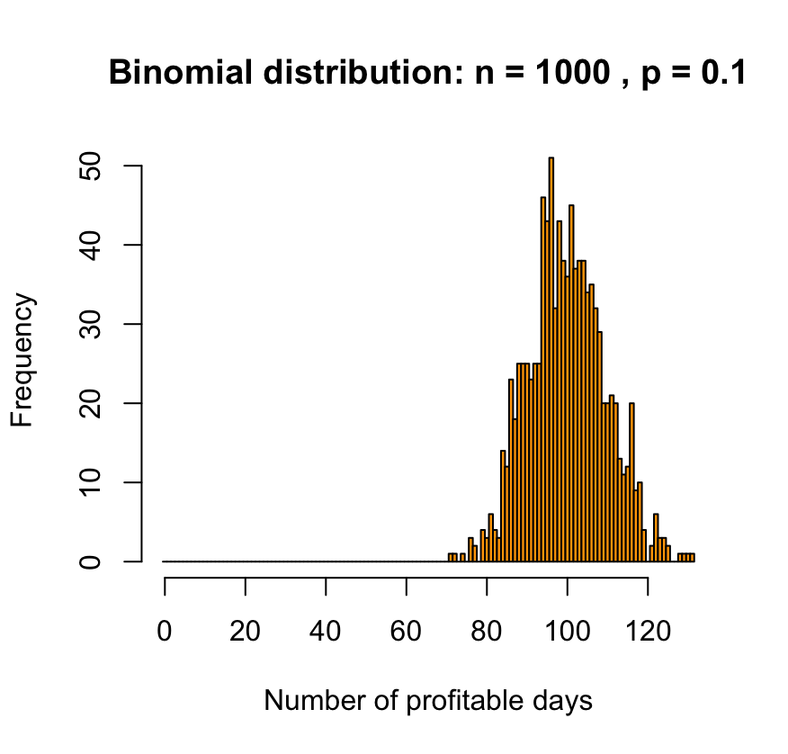

# Risky Portfolio Simulation using the Binomial Distribution

This repository contains an R script that simulates the performance of a risky portfolio over a fixed number of days. Each day, the portfolio has a fixed probability of producing a gain. The simulation models this behavior using the **binomial distribution**, allowing you to analyze how the number of profitable days evolves with increasing time horizons.

---

## Objective

We simulate a portfolio that runs for ( $$n$$ ) days, where each day is an independent trial with:

- Probability of gain (success): ( $$p = 0.1$$ )
- Probability of loss: ( $$1 - p = q$$ )

For each value of ( $$n$$ ), we simulate **1000 independent portfolios**, each composed of ( $$n$$ ) daily trades. We record how many of those ( $$n$$ ) days ended in profit for each simulation.

The number of profitable days in each simulation follows a **Binomial distribution**:

$$X \sim \text{Binomial}(n, p)$$

---

## Theoretical Background

Key formulas for the binomial distribution:

- **Expected value**:
- 
  $$E[X] = n \cdot p$$

- **Variance**:  
  
  $$\sigma^2(X) = n \cdot p \cdot (1 - p)$$
  

This reflects the total number of successes (profitable days) in ( $$n$$ ) independent Bernoulli trials.

---

## Code Description

The script performs the following steps:

1. Loops over increasing values of ( $$n$$ ) (e.g., 1 to 1000)
2. For each ( $$n$$ ), simulates 1000 portfolios of ( $$n$$ ) days
3. Plots a histogram showing the number of profitable days
4. Prints the empirical mean and standard deviation compared to the theoretical ones
5. Pauses between plots for user interaction

## Results

Below are representative histograms for selected values of `n`:

### n = 10

Distribution is skewed and discrete. Most portfolios yield 0 or 1 profitable days.

---

### n = 100

The shape starts resembling a normal distribution centered around the mean ( $$\mu = 10$$ ).

---

### n = 1000

Clear convergence to a Gaussian shape due to the Central Limit Theorem.

---

## Interpretation

This simulation answers the question:

> How many profitable days can I expect from a high-risk portfolio over a given time frame?

- As expected, the mean number of gains grows linearly with ( $$n$$ )
- The standard deviation grows like ( $$\sqrt{n}$$ ), leading to relatively tighter relative variation
- For large ( $$n$$ ), the distribution becomes approximately normal

This model captures how randomness in daily returns accumulates over time and illustrates both short-term volatility and long-term convergence properties.

---

## Conclusion

This simple yet powerful simulation demonstrates how the binomial distribution can model the number of profitable days in a risky portfolio. It provides useful insights into expected return variability and the emergence of Gaussian behavior in aggregated financial outcomes.

# Portfolio Waiting Time Simulation (Geometric Distribution)

This repository simulates the waiting time until the first success in a probabilistic financial scenario, modeled using the geometric distribution. The project is written in R and uses simple Monte Carlo simulation techniques to build intuition about probabilistic behavior in finance.

---

## Objective

We consider a risky portfolio with a 10% daily probability of gain (success), and simulate how many days it takes for the portfolio to achieve its first profitable day.

This is equivalent to modeling the waiting time until the first success in a Bernoulli process, where:

- Each trial (day) is independent
- Success occurs with probability ( $$p = 0.1$$ )
- The random variable $$( T \in \{1, 2, 3, \dots\} )$$ follows a geometric distribution:
  
$$ P(T = n) = p \cdot (1 - p)^{n-1}$$

---

## Theoretical Background

Key formulas for the geometric distribution:

- Expected value:  
  
  $$E[T] = \frac{1}{p}$$
  

- Variance:
  
  $$\sigma^2(T) = \frac{1 - p}{p^2}$$
  

- Probability mass function (PMF):  
  
  $$P(T = n) = p \cdot q^{n-1} \quad, q = 1 - p$$
  

---

## Code Description

The R script runs the following process for increasing sample sizes `n`:

1. For each value of `n`, it simulates `n` independent realizations of the geometric variable \( T \)
2. It plots a histogram of the values of \( T \)
3. It prints the empirical mean and standard deviation for comparison with theory
4. It pauses for the user to analyze the plot

## Results

Below are sample histograms for various values of `n`:

### n = 10

*Small sample size, high variance.*

---

### n = 100

*Distribution shape starts to emerge.*

---

### n = 1000

*Histogram closely matches the geometric PMF.*

---

## Interpretation

This simulation models a realistic financial question:

> How many days do I have to wait before my risky portfolio produces its first gain?

For \( p = 0.1 \):

- The expected waiting time is 10 days
- Most simulations yield values near 1–10
- Long tails exist: in some cases, one may wait 20 to 30 or more days
- As \( n \) increases, the empirical mean and standard deviation converge to their theoretical values

---

## Conclusion

This simulation provides intuitive insight into discrete waiting times in a probabilistic environment and offers a concrete analogy to financial risk modeling with delayed returns.
